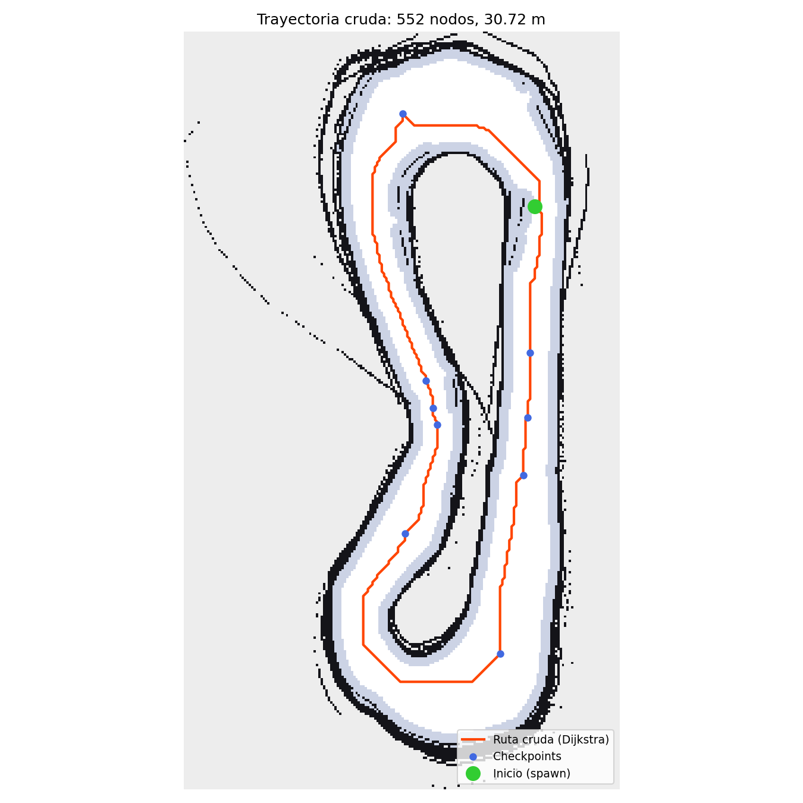
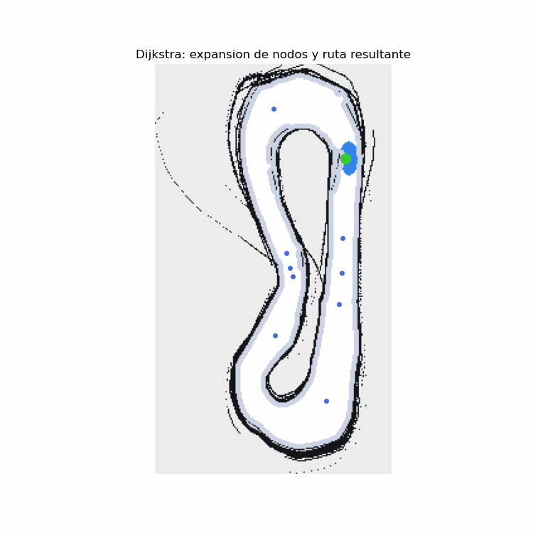
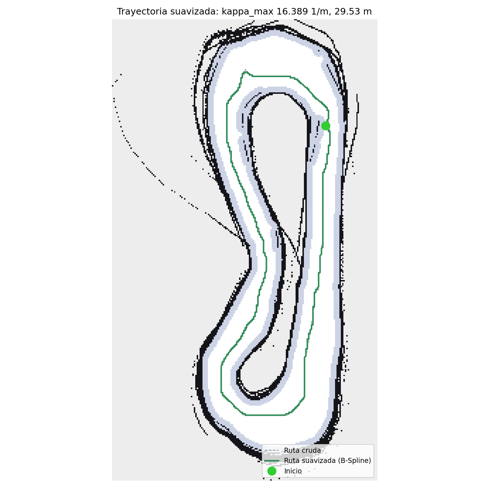
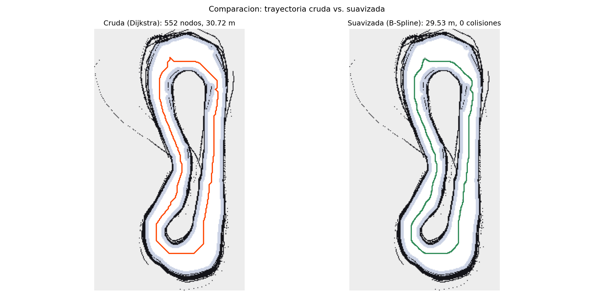
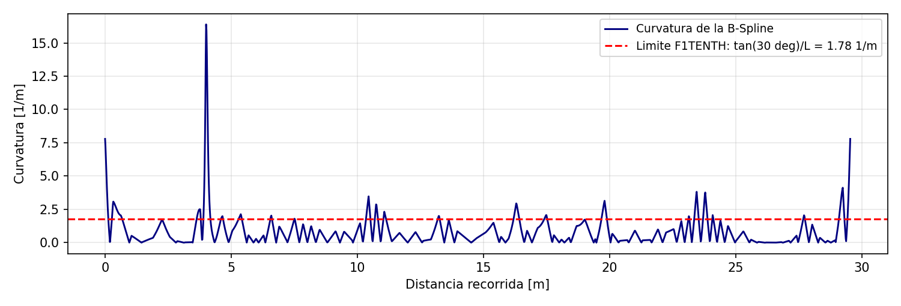

# Mapeo y Planificación Global de Trayectorias en AutoDRIVE — Dijkstra + Suavizado B-Spline

Proyecto desarrollado en el marco de la materia **Vehículos No Tripulados** (ESPOL), sobre el circuito F1TENTH del simulador **AutoDRIVE**. Cubre cuatro etapas: construcción de un mapa 2D del entorno mediante **SLAM** (SLAM Toolbox), planificación de una trayectoria global con **Dijkstra** desde el punto de spawn del vehículo hasta cerrar la vuelta completa, **suavizado** de esa trayectoria con una B-Spline cúbica paramétrica, y visualización del resultado final superpuesto sobre el mapa dentro del simulador.

**Autor:** Giovanny Andrés Baño Peña  
**Algoritmo de planificación asignado:** Dijkstra

---

## Videos de evidencia

- **Mapeo (SLAM en ejecución):** `<PEGAR ENLACE DE YOUTUBE>`
- **Planificación, suavizado y visualización final:** `<PEGAR ENLACE DE YOUTUBE>`

---

## 1. Instalación

### 1.1 Requisitos previos

Este repositorio **no** reemplaza la instalación del simulador AutoDRIVE ni del puente ROS 2 (`autodrive_f1tenth`). Se asume que eso ya está hecho siguiendo el Tutorial 1 de instalación del curso:

- **Ubuntu 22.04** + **ROS 2 Humble**
- **AutoDRIVE Simulator** (`AutoDRIVE Simulator.x86_64`), típicamente en `~/Downloads/AutoDRIVE_Sim`
- Workspace `~/autodrive_ws` con el paquete `autodrive_f1tenth` ya compilado dentro de su entorno virtual. Verificar con:

```bash
source ~/autodrive_ws/install/setup.bash
ros2 pkg list | grep autodrive_f1tenth
```

### 1.2 Dependencias de este paquete

```bash
sudo apt update
sudo apt install -y \
  ros-humble-slam-toolbox \
  ros-humble-nav2-map-server \
  ros-humble-nav2-lifecycle-manager \
  ros-humble-rviz2 \
  python3-colcon-common-extensions \
  python3-numpy python3-scipy python3-matplotlib python3-pil python3-yaml
```

No se requiere ninguna librería de planificación externa: el algoritmo de Dijkstra, el reparto de checkpoints y el suavizado B-Spline están implementados en este repositorio (`planning_utils.py`), apoyados únicamente en NumPy y SciPy.

### 1.3 Clonar y compilar

Este es un **workspace independiente** de `~/autodrive_ws`. La separación es intencional: el workspace de AutoDRIVE opera dentro de un `venv` con versiones fijadas de Flask, `python-socketio` y `python-engineio` que el puente Unity ↔ ROS 2 necesita para funcionar. Instalar ahí las dependencias científicas de este proyecto arriesga romper esas versiones. Este paquete se compila con el Python del sistema, **sin el `venv` activado**.

```bash
cd ~
git clone https://github.com/Giobapena/Mapping-and-DijkstraPlanning-Trayectory-AutoDrive.git
cd Mapping-and-DijkstraPlanning-Trayectory-AutoDrive
source /opt/ros/humble/setup.bash
colcon build --symlink-install
source install/setup.bash
```

Para los comandos que además necesitan el puente del simulador hay que sourcear **ambos** workspaces:

```bash
source /opt/ros/humble/setup.bash
source ~/autodrive_ws/install/setup.bash
source ~/Mapping-and-DijkstraPlanning-Trayectory-AutoDrive/install/setup.bash
```

---

## 2. Estructura del repositorio

```
├── img/                                        <- Imágenes usadas en este README
└── src/
    └── global_planner/                         <- Único paquete ROS 2 (ament_python)
        ├── package.xml
        ├── setup.py
        ├── setup.cfg
        ├── resource/global_planner
        ├── config/
        │   ├── mapper_params_online_async.yaml   <- Parámetros de SLAM Toolbox
        │   └── slam_mapping.rviz                 <- RViz para el mapeo en vivo
        ├── launch/
        │   └── trajectory_visualization.launch.py
        ├── rviz/
        │   └── trajectory.rviz                   <- RViz para la visualización final
        ├── maps/
        │   ├── F1tenth_Map.pgm                   <- ENTREGABLE Parte A
        │   └── F1tenth_Map.yaml
        ├── waypoints/                            <- ENTREGABLES Parte B
        │   ├── dijkstra_waypoints.csv                trayectoria cruda
        │   ├── dijkstra_waypoints_smooth.csv         trayectoria suavizada
        │   ├── trayectoria_cruda.png
        │   ├── trayectoria_suavizada.png
        │   ├── comparacion_crudo_vs_suavizado.png
        │   ├── curvatura.png
        │   └── dijkstra_search.gif
        └── global_planner/                       <- Módulo Python del paquete
            ├── planning_utils.py                 <- Núcleo: mapa, Dijkstra, B-Spline
            ├── generate_trajectory.py            <- Etapa 1: ruta cruda
            ├── smooth_trajectory.py              <- Etapa 2: suavizado
            ├── generate_gif.py                   <- Etapa 3: animación de la búsqueda
            └── global_path_publisher.py          <- Nodo ROS 2 de visualización
```

---

## 3. Parte A — Mapeo del entorno (SLAM)

### 3.1 Configuración de frames

Los frames de AutoDRIVE no siguen la convención estándar de ROS. El simulador ya publica la cadena `map → f1tenth_1 → lidar`, por lo que **no hace falta añadir ningún puente TF propio**: hacerlo crearía un segundo padre para `f1tenth_1` y rompería el árbol de transformadas. La configuración correspondiente en `config/mapper_params_online_async.yaml`:

| Parámetro | Valor | Justificación |
|---|---|---|
| `odom_frame` | `map` | AutoDRIVE ya publica `map → f1tenth_1`; ese TF cumple el rol odométrico |
| `map_frame` | `slam_map` | Nombre distinto para no colisionar con el `map` que publica el simulador |
| `base_frame` | `f1tenth_1` | Base del vehículo; sensores, ruedas y encoders cuelgan de este frame |
| `scan_topic` | `/autodrive/f1tenth_1/lidar` | `/scan` aparece en `ros2 topic list` pero **no tiene publicador** |
| `mode` | `mapping` | Construir y actualizar el mapa continuamente |

Cadena TF resultante: `slam_map → map → f1tenth_1 → lidar`.

### 3.2 Ajuste crítico: scan matching desactivado

La configuración de este proyecto fija `use_scan_matching: false` y `do_loop_closing: false`, en contra de los valores por defecto de SLAM Toolbox. La razón es específica de AutoDRIVE.

El TF `map → f1tenth_1` que publica el simulador proviene del sistema IPS, que en un entorno simulado es **ground truth**: posición exacta, sin ruido ni deriva acumulada. En esas condiciones el scan matching no corrige nada — corrompe una pose que ya era exacta. Cada vez que el algoritmo cree encontrar una alineación mejor entre dos escaneos, aplica una corrección sobre un dato sin error, y al cerrar la vuelta el optimizador del grafo de poses redistribuye ese error inventado por todo el mapa. El resultado observado fue un mapa con paredes duplicadas, en abanico y desalineadas, pese a que los puntos del LiDAR coincidían perfectamente con las paredes mientras el vehículo estaba detenido.

Con ambos mecanismos desactivados, SLAM Toolbox se limita a pintar cada escaneo en la pose exacta que le entrega el TF, y el mapa deja de poder deformarse. Los umbrales de viaje se bajaron además a `0.05 m` / `0.05 rad` para registrar escaneos con mayor frecuencia y aumentar el solape.

### 3.3 Cómo reproducirlo

```bash
# Terminal 1 — Puente Unity <-> ROS 2 (requiere el venv de autodrive_ws)
cd ~/autodrive_ws
source /opt/ros/humble/setup.bash && source venv/bin/activate && source install/setup.bash
export PYTHONUNBUFFERED=1
ros2 launch autodrive_f1tenth simulator_bringup_headless.launch.py

# Terminal 2 — Simulador AutoDRIVE (escenario F1TENTH)
cd ~/Downloads/AutoDRIVE_Sim
./"AutoDRIVE Simulator.x86_64"
#   IP Address: 127.0.0.1   |   Port Number: 4567
#   Clic en el ícono de antena -> debe mostrar "Connected"
#   Driving Mode: Autonomous

# Esperar 3-5 s a que el puente publique /clock, /tf y el LiDAR

# Terminal 3 — Teleoperación
ros2 run autodrive_f1tenth teleop_keyboard

# Terminal 4 — SLAM Toolbox
cd ~/autodrive_ws
CFG=$(ros2 pkg prefix global_planner)/share/global_planner/config/mapper_params_online_async.yaml
ros2 launch slam_toolbox online_async_launch.py slam_params_file:=$CFG use_sim_time:=true

# Terminal 5 — RViz
rviz2 -d $(ros2 pkg prefix global_planner)/share/global_planner/config/slam_mapping.rviz
```

`use_sim_time:=true` es obligatorio: el simulador publica su propio `/clock`. Si SLAM Toolbox usara el reloj real mientras los sensores usan tiempo de simulación, las transformadas fallarían y los escaneos se descartarían por antigüedad.

**Controles de teleoperación** (la terminal debe permanecer enfocada). Son acumulativos: cada pulsación suma o resta al valor actual, que se mantiene fijo hasta la siguiente.

| Tecla | Acción |
|---|---|
| `W` / `S` | Aumenta / disminuye el acelerador |
| `D` / `A` | Aumenta / disminuye el ángulo de dirección |
| `Q` | Dirección a cero (usar al salir de cada curva) |
| `E` | Freno de emergencia |
| `X` | Detiene y resetea todo a cero |

Se maneja **despacio** —acelerador entre 15 % y 25 %, unos 3 a 4 minutos por vuelta— durante dos vueltas completas, procurando ir por el centro de la pista. Ir rápido reduce el solape entre escaneos y produce paredes gruesas o duplicadas; acercarse demasiado a una pared hace que el LiDAR vea por encima de ella y contamine el mapa con espacio libre falso al otro lado.

El mapa se guarda desde el panel `SlamToolboxPlugin` de RViz: en el campo junto al botón **Save Map** se escribe una ruta absoluta **sin extensión**, por ejemplo `/home/gio/autodrive_ws/maps/F1tenth_Map`. Se generan `F1tenth_Map.pgm` (imagen de ocupación) y `F1tenth_Map.yaml` (resolución, origen y umbrales).

### 3.4 Resultado

| Mapa construido |
| --- |
|  |

Mapa trinario de 188 × 327 px a 0.05 m/px (9.4 × 16.4 m), con 0 = ocupado, 205 = desconocido y 254 = libre.

---

## 4. Parte B — Planificación global (Dijkstra) y suavizado (B-Spline)

### 4.1 Preprocesamiento: identificación de la pista

El mapa de SLAM contiene decenas de manchas de ruido sueltas y, sobre todo, **tres regiones de espacio libre bien diferenciadas**: el exterior del circuito, el anillo de la pista y el infield encerrado por la pared interior.

Un detalle importante y contraintuitivo: en este mapa la componente conexa **más grande no es la pista**, sino el área exterior al circuito.

| Componente | Celdas | Qué es |
|---|---|---|
| 1ª | 34 256 | Exterior del circuito |
| 2ª | **17 949** | **Pista** (la que interesa) |
| 3ª | 4 584 | Infield |

Por eso `find_track()` **no** selecciona por tamaño, sino que devuelve la componente conexa que **contiene al vehículo**, usando como semilla la celda correspondiente al punto de spawn leído de `/autodrive/f1tenth_1/ips`. El vehículo está sobre la pista por definición, así que ese criterio es robusto sin importar las proporciones del mapa. Si la semilla cayera sobre una pared o zona desconocida, se toma la componente libre más cercana en lugar de fallar.

Sobre esa máscara, `build_cost_field()` calcula una transformada de distancia euclídea —la distancia de cada celda a la pared más cercana— y de ahí obtiene dos cosas:

- **Máscara transitable:** celdas con holgura ≥ `--clearance`, lo que respeta el ancho del vehículo sin necesidad de un inflado binario de obstáculos.
- **Multiplicador de costo:** `mult = 1 + penalty · clip((d_ref − d)/d_ref, 0, 1)²`, que vale 1 en el centro del corredor y crece al acercarse a las paredes.

### 4.2 Algoritmo de planificación: Dijkstra

Búsqueda de costo uniforme sobre la grilla de ocupación 8-conectada, implementada con cola de prioridad (`heapq`). El costo de la arista entre dos celdas vecinas es la longitud del paso (1 para movimientos ortogonales, √2 para diagonales) multiplicada por el promedio de los multiplicadores de sus extremos:

```
w(a, b) = long(a, b) · (mult[a] + mult[b]) / 2
```

Todos los pesos son estrictamente positivos y **no se emplea heurística alguna**, de modo que la propiedad de optimalidad de Dijkstra se conserva íntegra: la ruta devuelta es la de mínimo costo total bajo esa métrica, es decir, la longitud penalizada por cercanía a pared. El efecto práctico del multiplicador es que la propia búsqueda del camino más corto prefiere el centro del corredor en vez de pegarse a los bordes, sin necesidad de un postproceso de centrado.

Se incluye además una comprobación **anti corner-cutting**: un paso diagonal solo se permite si las dos celdas ortogonales adyacentes también son transitables, evitando que la ruta se cuele por la esquina entre dos obstáculos dispuestos en diagonal.

### 4.3 Vuelta completa mediante checkpoints

Dijkstra es un planificador punto-a-punto: siempre devuelve el camino de menor costo entre un inicio y una meta. En un circuito cerrado, planificar de inicio a meta con ambos en el mismo lugar devolvería una ruta nula.

`lap_checkpoints()` resuelve esto repartiendo N puntos de paso por ángulo alrededor del centroide del anillo transitable, eligiendo dentro de cada sector angular la celda **más alejada de las paredes** (es decir, la de mayor valor en la transformada de distancia). `plan_lap()` planifica entonces un tramo Dijkstra entre cada par consecutivo, concatena los resultados y cierra el lazo volviendo al primero.

El primer checkpoint se **ancla al punto de spawn real del vehículo**, de modo que la trayectoria publicada arranca exactamente donde aparece el auto en el simulador.

El modo alternativo `--mode point` planifica un único tramo entre `--start` y `--goal`.

| Trayectoria cruda (Dijkstra) |
| --- |
|  |

| Animación de la búsqueda |
| --- |
|  |

En azul, los nodos expandidos por la búsqueda; en naranja, la ruta resultante; en verde, el punto de spawn; en azul intenso, los checkpoints de la vuelta.

### 4.4 Algoritmo de suavizado: B-Spline cúbica

La ruta cruda de Dijkstra es una polilínea de segmentos entre centros de celda, con cambios de rumbo abruptos de hasta 45° que un vehículo Ackermann no puede seguir. Se submuestrea cada `--step` metros y esos puntos de control se ajustan con una B-Spline cúbica paramétrica (`scipy.interpolate.splprep`, `k=3`, periódica cuando la ruta es un lazo cerrado). La curva se evalúa en 2000 puntos junto con sus derivadas primera y segunda, de donde se obtiene la curvatura:

```
κ(u) = |x'·y'' − y'·x''| / (x'² + y'²)^{3/2}
```

**Suavizado con escalera de seguridad.** El factor `s` de la B-Spline controla un compromiso: a mayor `s`, la curva es más suave y de menor curvatura, pero también tiene más libertad para "cortar camino" y potencialmente rozar una pared en una curva cerrada. En lugar de fijar un valor a dedo, `smooth_path_safe()` prueba una escalera de valores de más agresivo a más conservador y se queda con el **primero** que cumple simultáneamente dos condiciones:

1. Cero puntos de la curva fuera de la zona transitable.
2. `κ_max ≤ tan(δ_max)/L = tan(30°)/0.324 ≈ 1.78 m⁻¹`, el límite cinemático del F1TENTH.

La consola imprime la tabla completa de la escalera, de modo que la decisión queda documentada y es reproducible.

| Trayectoria suavizada (B-Spline) |
| --- |
|  |

| Comparación: cruda vs. suavizada |
| --- |
|  |

| Perfil de curvatura frente al límite cinemático |
| --- |
|  |

### 4.5 Variables importantes

| Parámetro | Defecto | Qué controla |
|---|---|---|
| `--mode` | `lap` | `lap` = vuelta completa; `point` = inicio → meta |
| `--start X Y` | `0.744 3.158` | Spawn del vehículo, leído de `/autodrive/f1tenth_1/ips` |
| `--goal X Y` | — | Meta (solo en modo `point`) |
| `--checkpoints` | `10` | En cuántos tramos se divide la vuelta completa |
| `--clearance` | `0.22 m` | Holgura mínima a pared exigida a la ruta |
| `--penalty` | `3.0` | Cuánto se penaliza pasar cerca de una pared |
| `--d-ref` | `0.60 m` | Distancia a partir de la cual ya no se penaliza |
| `--step` | `0.30 m` | Separación de los puntos de control de la B-Spline |
| `WHEELBASE` | `0.324 m` | Distancia entre ejes del F1TENTH |
| `MAX_STEER` | `0.5236 rad` | Ángulo máximo de dirección (30°) |
| `KAPPA_MAX` | `1.78 m⁻¹` | Curvatura máxima admisible, derivada de los dos anteriores |
| `resolution` | `0.05 m/px` | Resolución del mapa de SLAM |

### 4.6 Cómo ejecutar

Las tres etapas son scripts **offline**: operan sobre el mapa ya guardado y no requieren el simulador corriendo.

```bash
source /opt/ros/humble/setup.bash
source ~/Mapping-and-DijkstraPlanning-Trayectory-AutoDrive/install/setup.bash

ros2 run global_planner generate_trajectory --start 0.744 3.158
ros2 run global_planner smooth_trajectory
ros2 run global_planner generate_gif
```

Guía de ajuste según lo que reporte la consola:

| Mensaje | Ajuste |
|---|---|
| `Casi no queda zona transitable` | Bajar `--clearance` a `0.15` |
| `Dijkstra no encontro ruta` | Bajar `--clearance`; si persiste, el mapa tiene fugas y hay que remapear |
| Algún tramo con muy pocas celdas | Subir `--checkpoints` a `14` |
| Todos los valores de `s` salen descartados | Subir `--step` a `0.45` (menos puntos de control) |
| La ruta se pega a las paredes | Subir `--penalty` a `6.0` |

### 4.7 Resultados

Se verifica automáticamente que ningún waypoint —ni de la trayectoria cruda ni de la suavizada— cae fuera de la zona transitable, y que la curvatura máxima respeta el límite cinemático del vehículo. Ambos valores se imprimen en consola al ejecutar el planificador.

| Métrica | Valor |
|---|---|
| Componentes libres detectadas | 48 |
| Pista seleccionada | 17 949 celdas (44.9 m²) |
| Zona transitable (holgura ≥ 0.22 m) | 12 393 celdas |
| Nodos expandidos por Dijkstra | 22 834 |
| Nodos de la ruta cruda | 552 |
| Longitud de la trayectoria cruda | 30.72 m |
| Longitud de la trayectoria suavizada | `<COMPLETAR>` m |
| Curvatura máxima | `<COMPLETAR>` m⁻¹ (límite: 1.78 m⁻¹) |
| Colisiones (cruda / suavizada) | 0 / 0 |

---

## 5. Visualización final en el simulador

El nodo `global_path_publisher` lee los CSV generados y publica la trayectoria cruda en `/global_path_raw` (`nav_msgs/Path`) y la suavizada en `/global_path` junto con `/global_path_markers` (`visualization_msgs/MarkerArray`: línea verde, esfera verde en el inicio y roja en el final). Todo con QoS *transient local*, de modo que RViz reciba los mensajes aunque se conecte después de que fueron publicados.

El mapa se sirve con `nav2_map_server` en el frame `map` —el mismo que AutoDRIVE usa como referencia odométrica y con el que se construyó el mapa—, de modo que la trayectoria queda correctamente superpuesta sobre la pista y el vehículo se ve desplazarse encima de ella.

```bash
# Con el simulador AutoDRIVE ya abierto y conectado, y el puente corriendo:
source /opt/ros/humble/setup.bash
source ~/autodrive_ws/install/setup.bash
source ~/Mapping-and-DijkstraPlanning-Trayectory-AutoDrive/install/setup.bash

ros2 launch global_planner trajectory_visualization.launch.py
```

Esto levanta en conjunto: `nav2_map_server` sirviendo el mapa guardado en la etapa de mapeo, su gestor de ciclo de vida, `global_path_publisher`, y RViz ya configurado con el mapa, el LiDAR, el TF y ambas trayectorias.

| Trayectoria suavizada superpuesta en RViz |
| --- |
|  |

---

## 6. Entregables

| Archivo | Contenido |
|---|---|
| `src/global_planner/maps/F1tenth_Map.pgm` / `.yaml` | Mapa de ocupación (Parte A) |
| `src/global_planner/waypoints/dijkstra_waypoints.csv` | Waypoints de la ruta cruda (`x, y`) |
| `src/global_planner/waypoints/dijkstra_waypoints_smooth.csv` | Waypoints suavizados (`x, y, yaw, curvature`) |
| `src/global_planner/waypoints/dijkstra_search.gif` | Animación de la expansión de Dijkstra |
| `src/global_planner/waypoints/comparacion_crudo_vs_suavizado.png` | Comparación visual cruda vs. suavizada |
| `src/global_planner/waypoints/curvatura.png` | Perfil de curvatura frente al límite cinemático |

---

## Licencia

MIT. Todo el código de este repositorio es original; no incorpora librerías de planificación de terceros.

---

## Referencias técnicas

- [Documentación de SLAM Toolbox para ROS 2 Humble](https://docs.ros.org/en/humble/p/slam_toolbox/)
- [Repositorio oficial de SLAM Toolbox](https://github.com/SteveMacenski/slam_toolbox)
- [AutoDRIVE Ecosystem](https://autodrive-ecosystem.github.io/)
- Dijkstra, E. W. (1959). *A note on two problems in connexion with graphs*. Numerische Mathematik, 1(1), 269–271.
